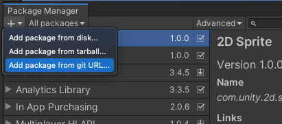
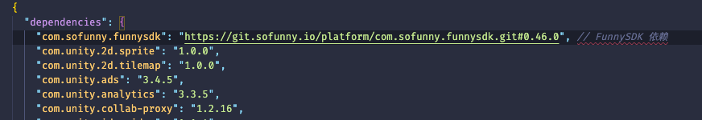

# com.sofunny.funnysdk

## 项目描述
FunnySDK 账号系统 Unity 引擎插件包，提供各项功能服务支持。

## 安装
- 使用 Unity Package Manager 面板形式

  1. 复制仓库地址以及相应 Tag 标签连接，如：https://git.sofunny.io/platform/com.sofunny.funnysdk.git#0.46.0

  2. 打开 Unity 项目的 Unity Package Manager 面板。

  3. 点击面板 + 号按钮，选择 Add package from git URL... 填入地址后，点击 Add。（等待集成即可..）

     

     

- 使用 Unity Package Manager 配置文件形式

  1. 打开 Unity 项目 Package 目录下的 manifest.json 文件。

  2. 添加 FunnySDK 依赖地址配置。如下：

     

- 手动集成形式
  1. 下载 [Releases](https://git.sofunny.io/platform/com.sofunny.funnysdk/-/releases) 下的包，将其内容解压至 Unity 项目中的 Plugins 目录下即可。

## 使用

待补充。。。
